# Экзамен по тактике

## Общие вопросы

### 1. Принципы современного общевойскового боя

Основными принципами являются

- ⚔️ Поддержание **постоянной боевой готовности** подразделений

- 💊 Своевременное **восстановление боеспособности** подразделений

- 💪 Полное **напряжение моральных и физических сил**, использование морально-психологического фактора в интересах выполнения боевой задачи

- 😡 **Активность и решительность** действий 

- 🤲🏿 + 🤲🏼 = 🤼 **Согласованное применение** подразделений родов войск и специальных войск и **поддержание непрерывного взаимодействия** между ними

- 💀 **Внезапность** действий и применение военной **хитрости**

- 🎯 Решительное **сосредоточение усилий** на главном направлении в решающий момент

- 🚓 **Маневр** подразделений ударами и огнём

- 🗿 **Твёрдое и непрерывное управление** подразделениями

### 2. Виды общевойскового боя и их краткая характеристика

- 🚫💨 **Противовоздушный бой** - бой подразделений, частей и соединений ПВО с СВН противника (самолётами, БПЛА, вертолётами, КР, баллистическими целями)

- 💨 **Воздушный бой** - бой авиации противостоящих сторон

- ⚓ **Морской бой** - бой кораблей различных классов противостоящих сторон

- 🚫💨 + 💨 + ⚓ **Общевойсковой бой** - бой с участием подразделений, частей и соединений различных родов войск и специальных войск. Ведётся объединенными усилиями соединений, частей и подразделений Сухопутных войск, Военно-воздушных сил, Воздушно-десантных войск, а на приморском направлении - и Военно-морского флота. Характерные черты: высокая напряжённость, скоротечность и динамичность боевых действий, их наземно-воздушный характер.
  
  - 🛡️ **Оборона (преднамеренная или вынужденная)**. Главная цель - отразить наступление противника, нанести ему потери и создать условия перехода своих войск в наступление. Также полезно для экономии сил, удержания территорий.
  
  - ⚔️ **Наступление** - основной вид боя, имеет решающее значение для достижения победы над врагом. Для эффективного ведения наступления, необходимо создать перевес в силах и средствах в 3-5 раз превышающий обороняющегося противника.

### 3. Принципы управления войсками и требования, предъявляемые к управлению

Принципы:

- 🥇 **Единоначалие**

- 🍆🍑 **Личная ответственность** командиров за принимаемые решения и результаты выполнения поставленных задач

- 🗿 **Твёрдость и настойчивость** в приведении в жизнь принятых решений и планов

- 👨 👨🏾 👩🏿 **Знание** личного состава и опоры на **подчинённых командиров**

- 🎯 **Централизация** управления

- 🧠 Постоянное **знание** и глубокий **анализ обстановки**, **предвидение** хода событий

- 🎨 Высокая **организованность и творчество** в работе органов управления

Требования к управлению:

- 🗿🗿 Устойчивость

- ⏩ Оперативность

- 🙈 Скрытность

- 🗿 Непрерывность

### 4. Способы управления подразделениями в бою

- 📶 **Сигнальные средства** - предназначены для коротких команд и донесений.
  
  - 👁️‍🗨️ Зрительные - семафоры, сигнальные флаги, фонари и огни
  
  - 👂 Звуковые - сирены, мегафоны, гудки, гильзы, куски рельса

- **Радио📻, голос 📣**

- 🚶🏿 **Личный пример**

### 5. Порядок работы командира взвода по организации боя

1. 🧠 Уясняет задачу 

2. 📋 Определяет мероприятия, которые необходимо провести немедленно для быстрейшей подготовки к выполнению боевой задачи

3. ⌛ Производит расчет времени

4. ★★★⚝⚝ Оценивает обстановку

5. ✅📣Единолично принимает решения и докладывает вышестоящему командиру

6. 🌳👿🌳 Проводит рекогносцировку (разведка на местности сил неприятельских войск)

7. 🗣️ Отдает устный боевой приказ

8. 🕹️ Организует взаимодействие и управление, дает указания по всестороннему обеспечению боя и управления

9. 🎒 Руководит непосредственной подготовкой подразделения к бою

10. 🏁 В установленное время докладывает вышестоящему командиру о готовности к выполнению боевой задачи

### 6. Содержание устного боевого приказа командира взвода

В боевом приказе командир взвода указывает

- 🗼🏠🌲 Ориентиры 

- 🏠🗼🌲Объекты и цели, поражаемые средствами старшего командира

- ★★★⚝⚝ 👿 Краткие вывод из оценки противника

- 📋🔷Задачу взвода

- 📋🔹 Боевые задачи подразделениям

- 💺 Своё место в бою и своего заместителя

- ⛽ Расход ракет и боеприпасов

- ⌛ Время готовности к выполнению задачи

### 7. Содержание замысла

Замысел определяет

- ↗️ Направления сосредоточения основных усилий

- 🌪️ Как и какими силами будет достигаться поставленная задача

- 🔀 Боевой порядок

~~Не знаю, что значит замысел, но вот~~

## Структуры

### 8. Предназначение, организационная структура, основное вооружение мотострелкового батальона ВС РФ (до отдельного взвода) графически

**Предназначение МСБ** - для уничтожения живой силы 🚶🏻‍♀️ и техники противника 🚓 в ближнем бою, как самостоятельно, так и во взаимодействии с танковыми, артиллерийскими подразделениями, а также с подразделениями других родов войск и специальных войск. Организационно мотострелковый батальон входит в состав мотострелкового полка.

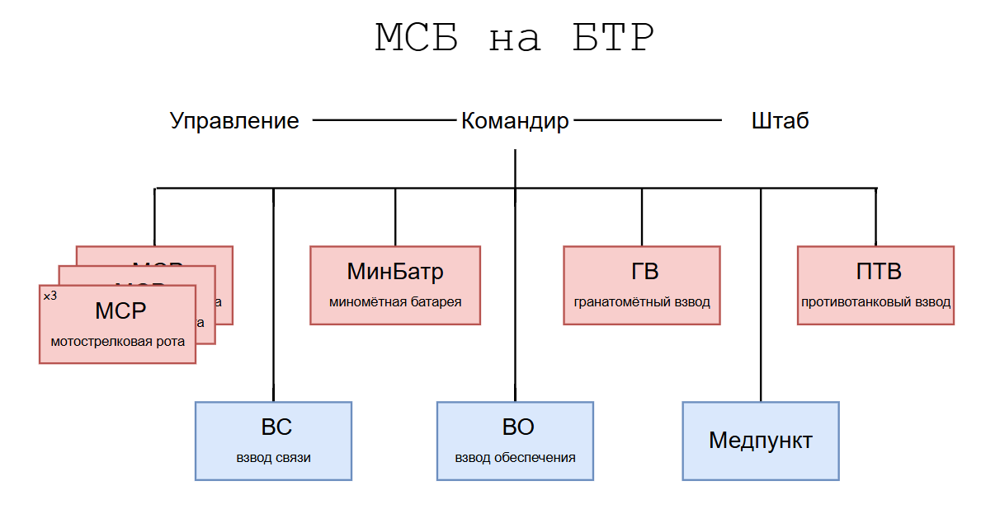

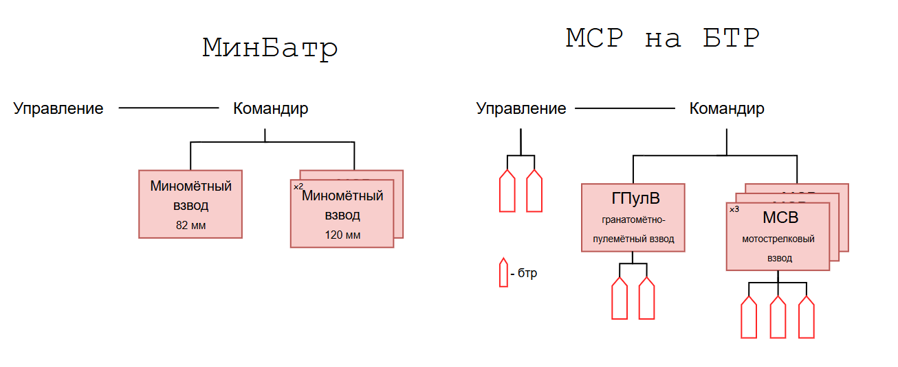

**Вооружение**

- Минбатр (включает 3 миномётных взвода)
  
  - 2 взвода имеют 120мм миномёт **"Сани"** (4 шт во взводе)
  
  - 1 взвод имеет 82мм миномёт **"Василёк"** (3 шт) 

- ГВ - имеет на вооружении 6 автоматических станковых гранатомётов **"Пламя"** (АГС-17(30))

- ПТВ (состоит из 3-х отделений)
  
  - 2 отделения вооружены **ПТКР** (по 2 в каждом отделении)
  
  - 1 отделение вооружено 2-мя станковыми гранатомётами **СПГ-9**

- ГПулВ - имеет **3 ПТРК** и **2 7х62мм пулемёта Калашникова** модерн.

### 9. Предназначение, организационная структура, основное вооружение танкового батальона ВС РФ (до отдельного взвода) графически

**Предназначение ТБ** - для поддержки мотострелковых подразделений и выполнения самостоятельных задач на направлении сосредоточения основных усилий. Организационно танковых батальон входит в состав мотострелковой бригады (МСБр)

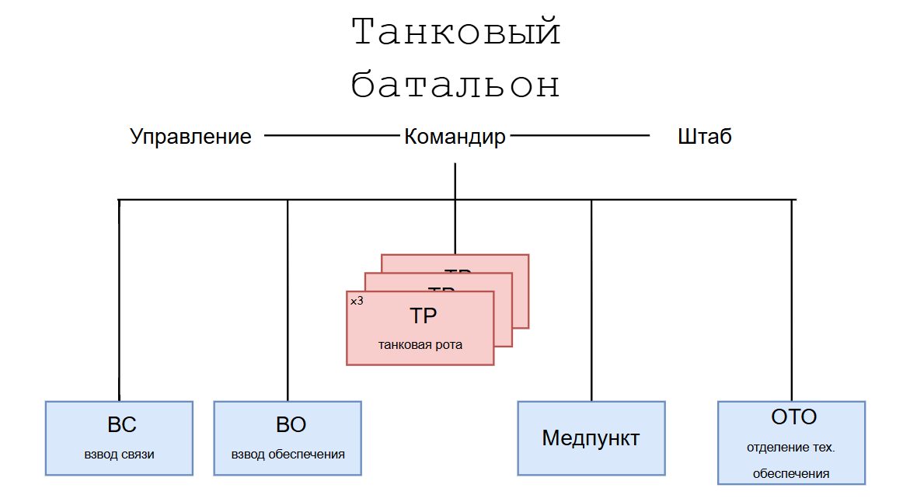

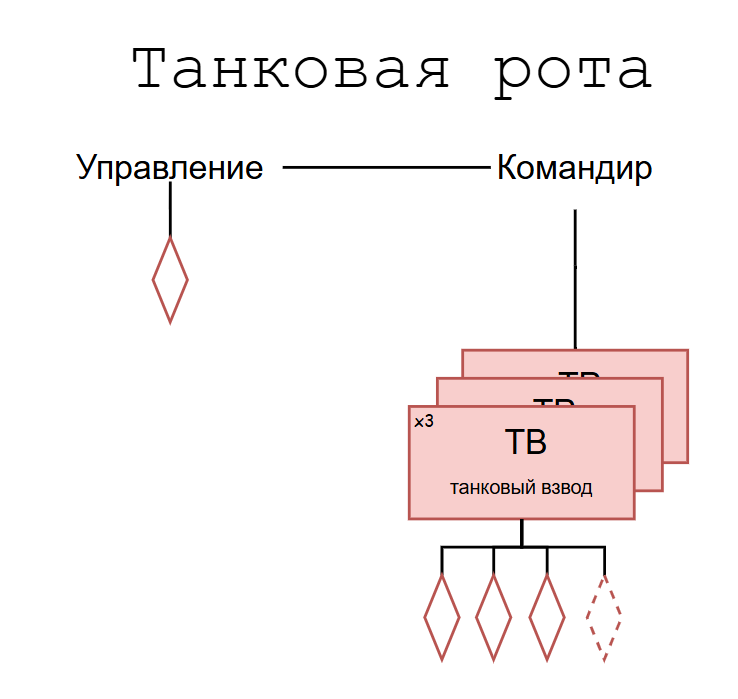~~ХЗ что по вооружению~~

### 10. Организация мотопехотного батальона армии США (до отдельного взвода, показать графически)

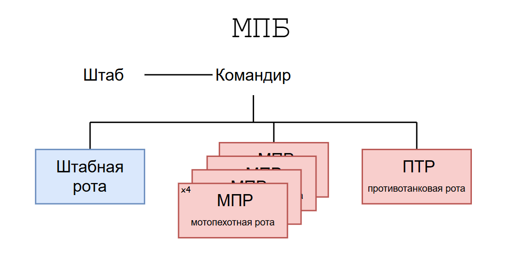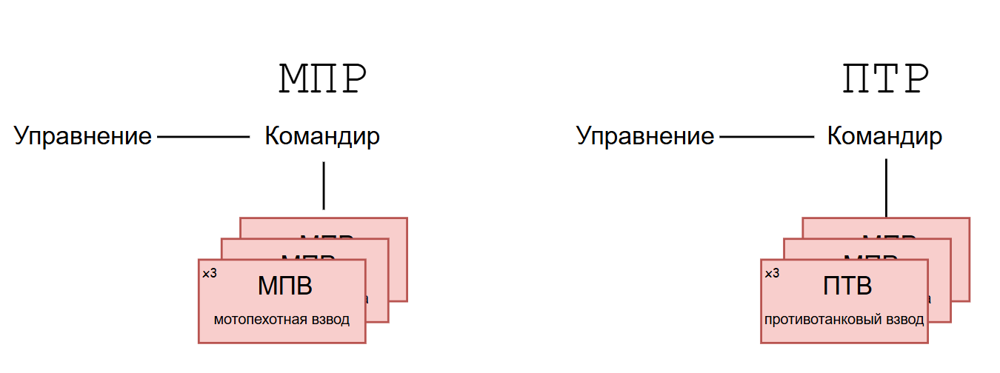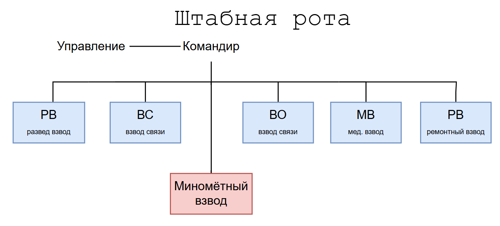

### 11. Организация мотопехотного батальона армии ФРГ (до отдельного взвода, показать графически)

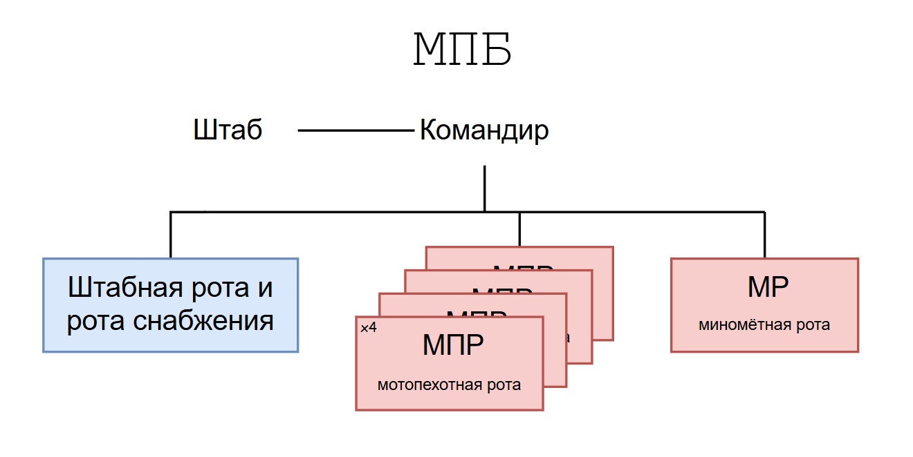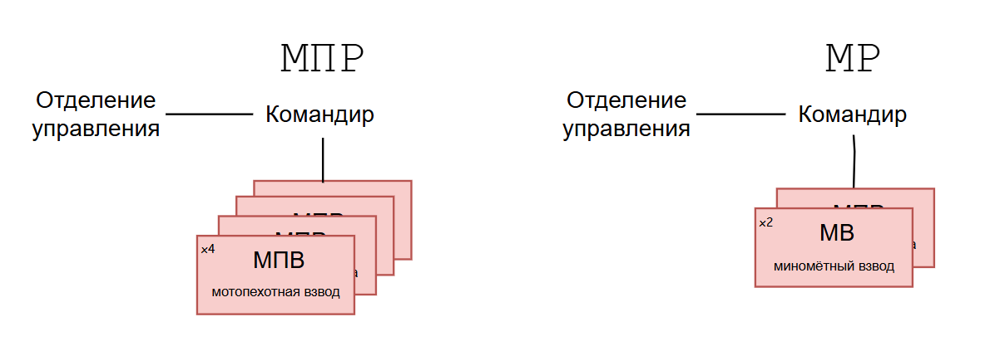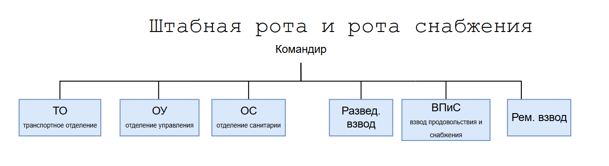

## Оборона

### 12. Сущность современного оборонительного боя, его характерные черты

**Оборона проводится с целью:** 

- ༺|༻ отражения наступления превосходящих сил противника

- 💯 нанесения ему максимальных потерь

- 🗿 удержания важных районов (рубежей) местности и тем самым создания выгодных условий для последующих действий

В зависимости от боевой задачи, наличия сил и средств, а также от характера местности оборона может быть **позиционной** 🏫 и **маневренной** 🚗.

**🏫 Позиционная оборона** – основной вид обороны. Она наиболее полно отвечает главной цели обороны и ведется путем нанесения максимальных потерь противнику в ходе упорного удержания подготовленных к обороне районов местности. Позиционная оборона применяется на большинстве направлений и прежде всего там, где потеря территории недопустима.

**🚗 Маневренная оборона** – применяется в целях нанесения противнику потерь, выигрыше времени и сохранения своих сил путем последовательных оборонительных боев на заранее замеченных и эшелонированных в глубину рубежах в сочетании с короткими контратаками. Она допускает оставление некоторой части территории. В ходе маневренной обороны обороняющиеся части и подразделения вынуждают противника наступать в направлении, на котором подготовлена устойчивая позиционная оборона или противник вовлекается в район, обеспечивающий выгодные условия его разгрома контратаками

### 13. Требования, предъявляемые к обороне. Условия перехода к обороне

Требования (оборона должна быть):

- ☢️ Активной

- ⚖️ Устойчивой

- 🚫🚗Противотанковой

- 🚫💨Противовоздушной

- 🚫🤸‍♂️💨Противодесантной

- 🍆 Глубокоэшелонированной

- 👨+⌛=🧔 Готовой к длительному ведению боя

Условия перехода к обороне (возможные, я так понимаю):

- Вынужденно

- Преднамеренно

- Отсутствия соприкосновения с противником

- Непосредственного соприкосновения с противником

### 14. Боевой порядок подразделений в обороне. Боевой порядок МСО (графически)

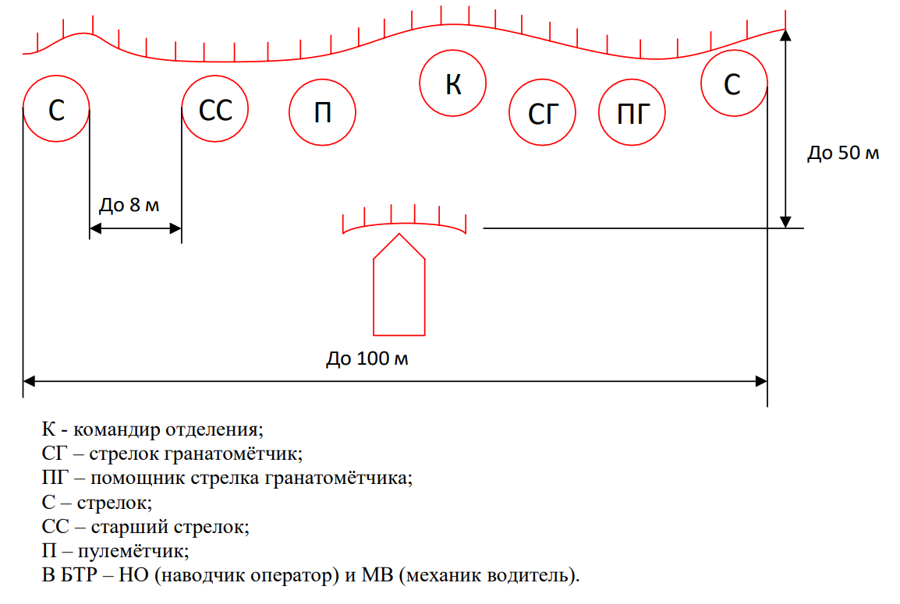

### 15. Боевой порядок подразделений в обороне. Боевой порядок МСВ (графически)

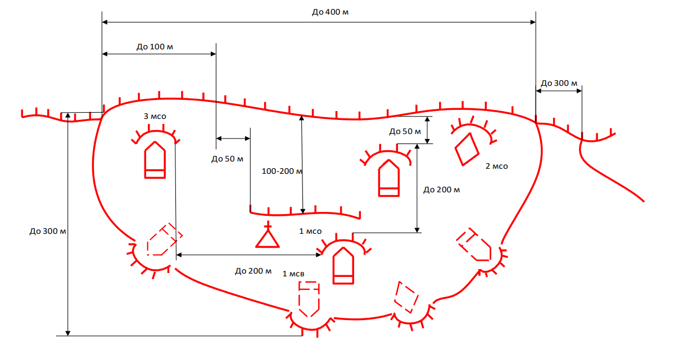

### 16. Боевой порядок подразделений в обороне. Боевой порядок МСВ (графически)

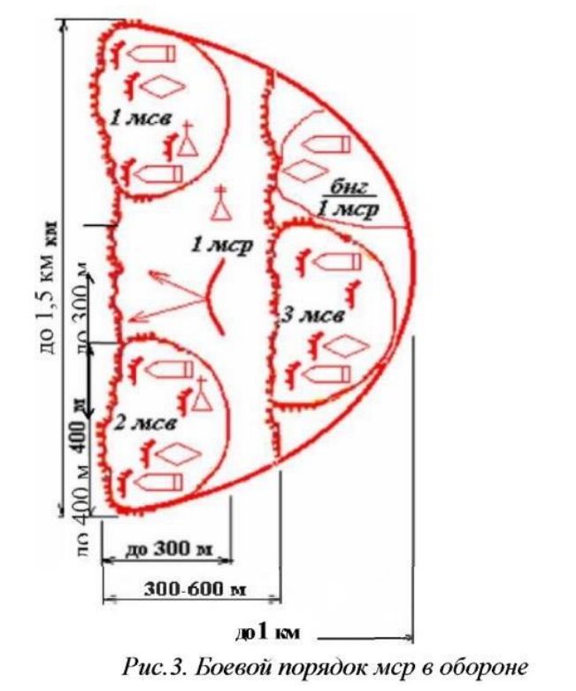

## Наступление

### 17. Цель наступления, виды наступления и их способы

Наступление проводится **с целью разгрома** противостоящего **противника** 👿 и овладения назначенным **рубежом 🏢 или районами** местности и создания условий **для** ведения **последующих действий**

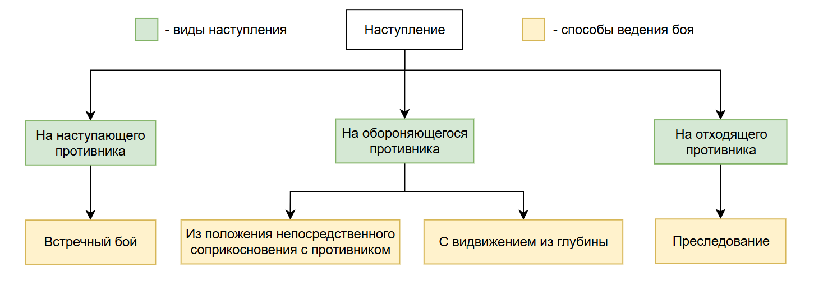

### 18. Наступление с ходу на обороняющегося противника (пояснить схемой)

Для обеспечения организованного выдвижения подразделений к переднему краю обороны противника и одновременной атаке батальону (роте) назначается:

- 🗺️ Маршрут выдвижения

- 🏴󠁢󠁳󠁢󠁰󠁿 Исходный пункт – назначается для своевременного начала выдвижения из исходного района. Его удаление должно обеспечивать вытягивание колонны батальона со средствами усиления из занимаемых районов, достижении ими установленной скорости и может составлять 5-10 км от внешней границы исходного района

- 🔷➡️🔶🔶 Рубежи развертывания в ротные колонны – назначаются вне досягаемости огня прямой наводкой орудий, танков и установок противотанковых ракетных комплексов противника на удалении 4-6 км от переднего края обороны противника;

- 🔶➡️🔸🔸 Рубежи развертывания во взводные колонны – назначаются по возможности за складами местности в 2-3 км от переднего края обороны противника;

- ⚔️ Рубеж перехода в атаку – выбирается так, чтобы его удаление обеспечивало танковым и мотострелковым подразделениям ведение действительного огня из основных видов оружия и позволяло им безостановочно на максимальной скорости достичь переднего края обороны противника в указанное время «Ч». Рубеж перехода в атаку может назначаться на удалении до 600 м от переднего
  края противника, а иногда и более.

Для согласования действий мотострелковых (танковых) и артиллерийских подразделений, ведущих огонь с закрытых огневых позиций, а также гранатометных подразделений назначается рубеж безопасного удаления от разрывов своих снарядов и мин (гранат). Безопасное удаление для мотострелковых подразделений, атакующих в пешем порядке – 400 м, атакующих на боевых машинах пехоты  бронетранспортерах) – 300 м, для танковых подразделений – 200 м.

### 19. Сущность наступления из непосредственного соприкосновения с противником

**Сущность** наступления из положения непосредственного соприкосновения с противником **заключается в том**, что **подразделения заблаговременно 🕝 и скрытно 🙈 занимают исходное положение 🏛️ и после** мощной **огневой 🔥 подготовки переходят в атаку ⚔️**

### 20. Боевые задачи подразделений в наступлении (МСО и МСВ)
